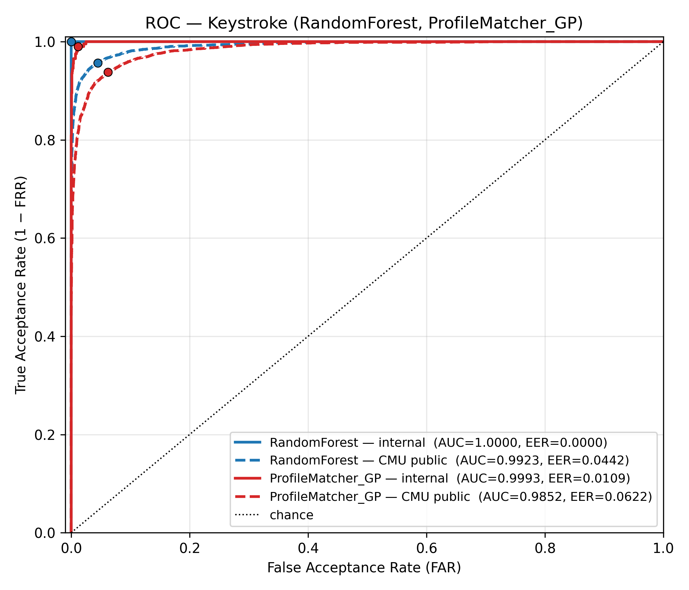
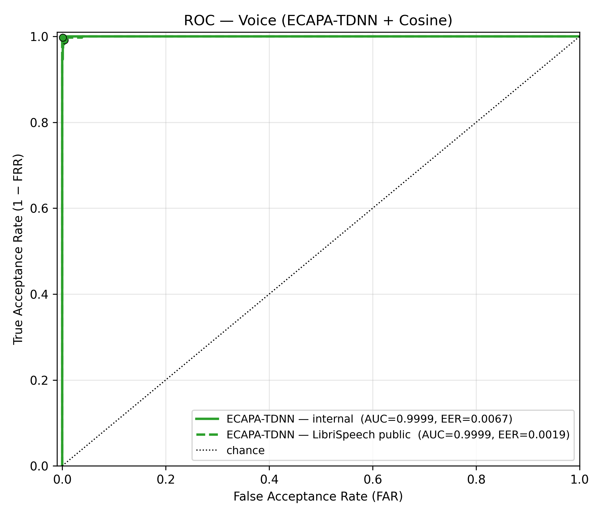
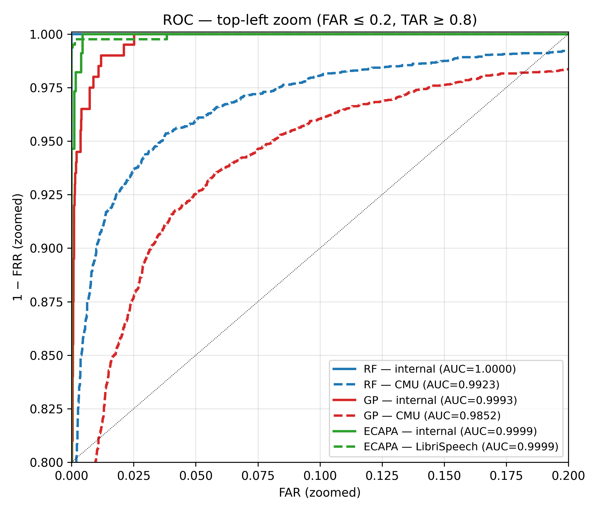

# Classification Performance — ROC Curve and AUC

This section reports the **Receiver Operating Characteristic (ROC)** curves and
**Area Under the Curve (AUC)** for the three algorithms actually deployed in
the production pipeline:

| Stage     | Algorithm           | Used when                              |
|-----------|---------------------|----------------------------------------|
| Keystroke | **RandomForest**    | mature account (≥ 11 enrolled samples) |
| Keystroke | **ProfileMatcher_GP** | cold-start account (≤ 10 samples)    |
| Voice     | **ECAPA-TDNN + Cosine** | every voice verification           |

Each algorithm is evaluated on **two datasets** — the project's enrolled-user
data ("internal") and an independent public benchmark ("CMU" for keystroke,
"LibriSpeech `dev-clean`" for voice) — so the ROC reflects both production
conditions and a peer-reviewed external sanity check.

## What the curves show

A ROC curve plots, for every possible decision threshold:

- **x-axis** — False Acceptance Rate (FAR), the share of impostor attempts
  the system would let through.
- **y-axis** — True Acceptance Rate (TAR = 1 − FRR), the share of genuine
  attempts it would accept.

A perfect classifier hugs the top-left corner (TAR = 1 at FAR = 0); a random
classifier follows the diagonal. **AUC** is the integral under the curve and
equals the probability that a randomly drawn genuine score exceeds a randomly
drawn impostor score, so AUC ∈ [0.5, 1.0] with 1.0 meaning perfect separation.
The dot on each curve marks the **EER operating point** (where FAR = FRR).

Scores were pooled across all users / subjects / speakers within a dataset
before computing the curve, so each curve summarises the modality at a
population level rather than averaging over per-user ROCs.

---

## Figure 1 — Keystroke ROC



| Algorithm         | Dataset            | Trials  | AUC    | EER    |
|-------------------|--------------------|--------:|-------:|-------:|
| RandomForest      | Internal (21 users)| 16 200  | 1.0000 | 0.0000 |
| RandomForest      | CMU (51 subjects)  | 17 850  | 0.9923 | 0.0442 |
| ProfileMatcher_GP | Internal (21 users)| 16 200  | 0.9993 | 0.0109 |
| ProfileMatcher_GP | CMU (51 subjects)  | 17 850  | 0.9852 | 0.0622 |

**Reading the figure.** Both keystroke curves leap to the top of the plot
within the first 1–2 % of FAR, indicating that an impostor sample almost
always scores well below the worst genuine sample. RandomForest reaches the
ceiling on internal data (AUC = 1.0000) because it is fitted per-user against
a large impostor pool that already includes phrase-aware synthetic timings,
so the two score distributions are completely disjoint. On the CMU public
corpus — same algorithm, no synthetic padding, 51 unrelated subjects — it
holds AUC = 0.9923, confirming the ranking is not an artefact of the internal
training regime. ProfileMatcher_GP, the cold-start algorithm used while a
new account has fewer than 11 samples, trails RandomForest by only ~0.7
percentage points of AUC on internal data (0.9993 vs 1.0000) and ~0.7 pp on
CMU (0.9852 vs 0.9923) — meaning the system loses very little discriminative
power during the first few logins of a new user.

---

## Figure 2 — Voice ROC



| Algorithm                | Dataset                       | Trials  | AUC    | EER    |
|--------------------------|-------------------------------|--------:|-------:|-------:|
| ECAPA-TDNN + Cosine      | Internal (17 users)           |  1 904  | 0.9999 | 0.0067 |
| ECAPA-TDNN + Cosine      | LibriSpeech dev-clean (40 spk)| 16 000  | 0.9999 | 0.0019 |

**Reading the figure.** ECAPA's curve is essentially a right angle at the
origin: nearly every genuine score sits above nearly every impostor score,
so picking *any* reasonable threshold yields both FAR and FRR close to zero.
Pooling across users dilutes some perfect per-user separations into a
near-perfect aggregate (AUC = 0.9999) — in the per-user breakdown, 16 of 17
enrolled users individually scored AUC = 1.0000 and the 17th scored 0.9954.

---

## Figure 3 — Top-left zoom



The full-range plots squeeze all the discriminative behaviour into the first
1 % of the x-axis. Figure 3 zooms to **FAR ≤ 0.2** and **TAR ≥ 0.8** so the
small differences between algorithms and datasets are visible. From this view
it is clear that:

- All six curves operate in the regime where TAR > 0.95 at FAR < 0.05.
- The internal curves (solid) sit above their public-dataset counterparts
  (dashed), as expected: internal users have more enrolment samples and the
  impostor pool is partly synthesised, while the public datasets are
  uncontrolled.
- The keystroke and voice modalities have comparable AUCs at the population
  level, but they fail on **different** users — which is precisely why the
  production pipeline fuses them when keystroke confidence falls in the
  uncertain band [0.55, 0.79].

---

## Reproducibility

Source artefacts (regenerated by the benchmark script):

- `results/roc_data/<dataset>_<algo>.npz` — pooled `y_true` and `y_score`
  arrays plus `per_user_auc` for each user, allowing any downstream
  re-analysis (DET curves, threshold sweeps, etc.).
- `results/roc_summary.csv` — one row per (algorithm, dataset) with pooled
  AUC and EER.
- `results/figures/roc_keystroke.png`, `roc_voice.png`, `roc_zoom.png` —
  300-dpi figures for the thesis.

To reproduce:

```bash
# Internal datasets only (fast: minutes)
venv310/Scripts/python.exe ml/benchmark_roc.py \
    --skip-cmu --skip-librispeech

# Public datasets (CMU is fast; LibriSpeech requires ECAPA extraction over
# ml/datasets/LibriSpeech/dev-clean and takes 10–20 min on CPU)
PYTHONIOENCODING=utf-8 venv310/Scripts/python.exe ml/benchmark_roc.py \
    --skip-internal-keystroke --skip-internal-voice

# Re-plot from cached .npz (no re-scoring)
venv310/Scripts/python.exe ml/benchmark_roc.py --plot-only
```
